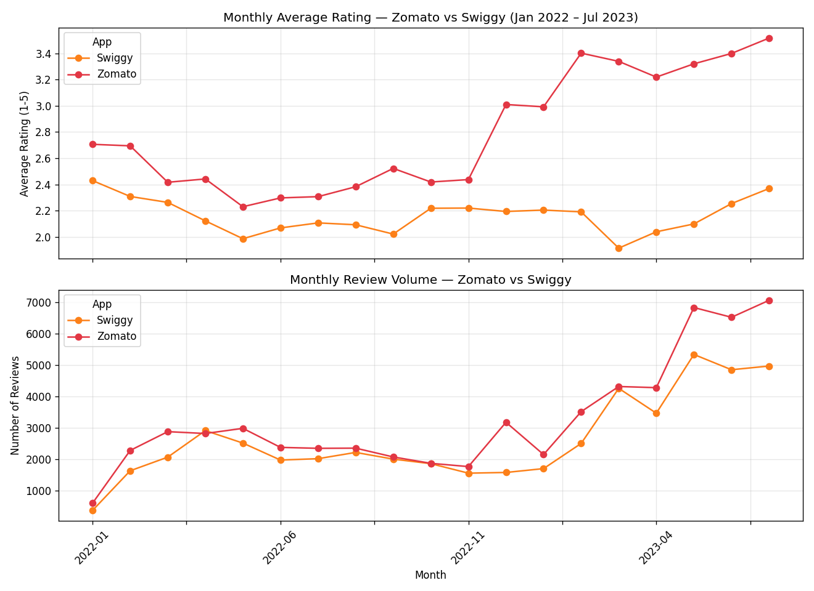
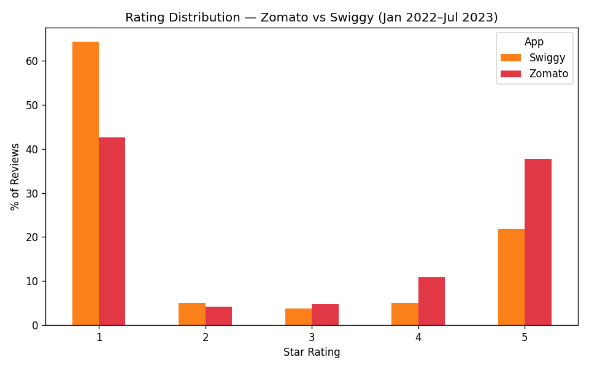
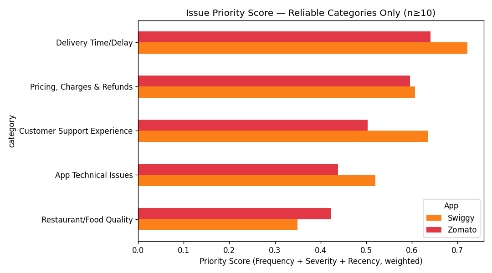

# Review-to-Roadmap: AI-Assisted Issue Prioritization for Zomato vs. Swiggy

**Stack:** Python | Pandas | Matplotlib | Claude (AI-Assisted Labeling)
**Role Simulated:** Product Analyst — Customer Experience Intelligence

---

## 📌 Project Overview

This project analyzes 111,927 real Play Store reviews across Zomato and Swiggy (scoped to the most recent 18 months from a 5-year, 465,660-review dataset) to answer a question ratings alone can't: not just *that* satisfaction is dropping, but *which specific issues* are driving it, how severe each one is, and whether it's getting better or worse — then rank them into a evidence-backed action list for each product team.

**Tools Used:** Python (Pandas, NumPy, Matplotlib) | Claude (AI-assisted issue classification)
**Dataset:** Zomato & Swiggy Play Store Reviews — Kaggle (saloni1712)
**Records:** 111,927 reviews (scoped) | **Window:** Jan 2022–Jul 2023 | **Apps:** 2

---

## 🎯 Business Problem

Product and CX teams receive thousands of app reviews every month with no systematic way to convert them into prioritized action. Key questions:

- Is satisfaction actually declining, and when did it start?
- What specific issues (not just "bad reviews") are customers describing?
- Which issues are most frequent, most severe, and trending worse?
- How do Zomato and Swiggy compare on the same issues?

---

## 🔍 Key Findings

### Finding 1 — Swiggy's Reputation Gap Is Structural, Not Seasonal
- Average rating: **Swiggy 2.15** vs. **Zomato 2.97** across the full window
- Swiggy sits below Zomato in **every single month** — not a one-off dip
- Review volume roughly **doubled for both apps from Nov 2022 onward** — but Zomato's rating *improved* alongside that growth while Swiggy's did not

### Finding 2 — Delivery Time/Delay Is the Universal #1 Priority
- Highest Priority Score for **both apps** (Zomato 0.641, Swiggy 0.722)
- ~26% of all issue-tagged reviews on both platforms
- **>90% severity on both** — when this issue occurs, it's a 1–2★ review almost every time

### Finding 3 — Customer Support Is a Swiggy-Specific Weak Point
- Priority Score **0.635 (Swiggy) vs. 0.503 (Zomato)**
- Nearly double the frequency share (19.8% vs. 12.8%)
- Reviews specifically describe complaints being closed without resolution — a process issue, not just a staffing one

### Finding 4 — Zomato's Pricing Complaints Are High-Frequency, Lower-Severity
- **32.6%** of Zomato's issue reviews mention pricing/charges — its single highest-frequency category
- But only **60.7% severity** vs. Delivery's 90.9% — a transparency/communication issue, not a fundamental pricing one

---

## 🤖 AI-Assisted Classification & Validation

| Step | Detail |
|---|---|
| Taxonomy | 8 fixed business categories, defined upfront (not AI-discovered) |
| Sample | 301 reviews (151 Zomato, 150 Swiggy), stratified by rating × time period |
| Method | AI-assisted labeling — each review read and assigned one category + reason |
| Validation | 15-review manual spot-check → **15/15 (100%) agreement** |

A fixed taxonomy and a stratified, validated sample were chosen deliberately over full-population automation — at this sample size, this gave equally rigorous, fully auditable results without unnecessary engineering overhead.

---

## 🛠 Technical Approach

### Data Preparation & EDA
- Combined Zomato + Swiggy exports, parsed dates, scoped to most recent 18 months
- Verified repeated review text (e.g. "Super fast delivery" ×264) reflected genuine independent users, not duplicate errors — chose not to remove them
- Validated `thumbsUpCount` correlates with negative ratings before using it as a severity signal

### Issue Taxonomy & AI-Assisted Classification
- 8 categories fixed in advance: Delivery Time/Delay, App Technical Issues, Order Accuracy, Pricing/Charges & Refunds, Customer Support Experience, Payment/Transaction Issues, UX/Navigation, Restaurant/Food Quality
- Stratified sample classified via AI-assisted labeling against this taxonomy, manually validated

### Priority Scoring
- **Frequency** — share of issue-tagged reviews in that category
- **Severity** — % of the category's reviews that are 1–2★
- **Recency/Trend** — % change in category share, first half vs. second half of window
- **Priority Score = 0.35×Frequency + 0.40×Severity + 0.25×Recency**

---

## 📊 Chart Preview

### Monthly Rating & Volume Trend — Zomato vs. Swiggy


### Rating Distribution Comparison


### Issue Priority Matrix (Reliable Categories, n≥10)


---

## 📁 Repository Structure

```
review-to-roadmap/
├── README.md
├── review_to_roadmap_analysis.ipynb
├── data/
│   ├── zomato_dataset.csv   # last 18 months, as used in the analysis
│   └── swiggy_dataset.csv   # last 18 months, as used in the analysis
├── outputs/
│   ├── reviews_tagged.csv
│   ├── priority_matrix_zomato.csv
│   └── priority_matrix_swiggy.csv
└── charts/
    ├── 01_monthly_rating_volume.png
    ├── 02_rating_distribution.png
    └── 03_priority_matrix.png
```

---

## ⚠️ Project Limitations

1. **Single-snapshot data** — Sep 2018–Jul 2023; no visibility into trends after the scrape date
2. **Review-selection bias** — reviewers skew toward the very satisfied or very dissatisfied (confirmed: 64.4%/42.6% of reviews are 1★), a known limitation of app-store review data generally
3. **Sample-based AI classification** — 301 of ~112,000 scoped reviews were classified; several categories (Payment, Order Accuracy, App Technical, UX) have too few reviews (2–12) for reliable trend conclusions
4. **No competitor benchmark beyond Zomato/Swiggy** — findings are relative to each other, not the wider market
5. **No implementation feedback loop** — recommendations are evidence-based but untested; no data on whether proposed fixes would work if implemented

---

## 🚀 How to Reproduce

### Prerequisites
- Python 3.9+ with Pandas, NumPy, Matplotlib, Jupyter

### Step 1 — Data
`data/` contains the dataset already scoped to the most recent 18 months (Jan 2022–Jul 2023), matching what the notebook analyzes. To start from the full raw history instead, download the original dataset from Kaggle (linked below) and apply the scoping step shown in the notebook's Section 3.

### Step 2 — Run the Notebook
Open `review_to_roadmap_analysis.ipynb` and run cells sequentially — covers cleaning, EDA, classification methodology, priority scoring, and insights

### Step 3 — AI-Assisted Classification
Classification results are provided in `outputs/reviews_tagged.csv`; to reproduce on a new sample, apply the taxonomy defined in the notebook using an AI assistant of your choice, following the same stratified sampling and validation approach

---

## 🔗 Data Source

Dataset: [Zomato & Swiggy Play Store Reviews — Kaggle](https://www.kaggle.com/datasets/saloni1712/zomato-and-swiggy-play-store-reviews)

---

## 👤 Author

**Tanishka Anand**
Data Analyst | AI-Assisted Analytics
